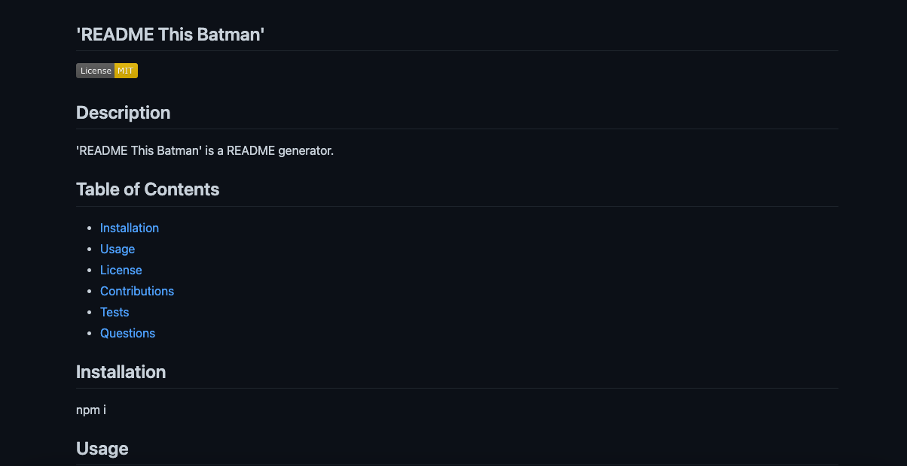

# README-THIS-BATMAN

A README generator powered by:

- node.js
- inquirer

[This is an external link to the 'README This Batman' repository](https://github.com/rhodemc/readme-this-batman)

## Description

I was motivated to create a README generator because it is an efficient way to make a README file without distracting from the coding work, itself.

When using this README generator, you'll find responsive prompts that populate a detailed and structured README file.

## Installation

Once the repository is downloaded, please navigate to the correct file path in your command terminal and enter 'npm i' to install the necessary dependencies.

## Usage

Once necessary dependencies are installed, run 'node index' in your command terminal to begin the README generation.

Future updates will include more license options.

[This is an external link to the 'README This Batman' usage video](https://drive.google.com/file/d/1d1w4BhVwKE549f4TgC0vx3Y5AIbITNz5/view)

## Credits

README This Batman was initially built with starter code provided by the University of Oregon's Full-Stack Bootcamp.

## License

This project is licensed by MIT. Please refer to the documentation in the repo.